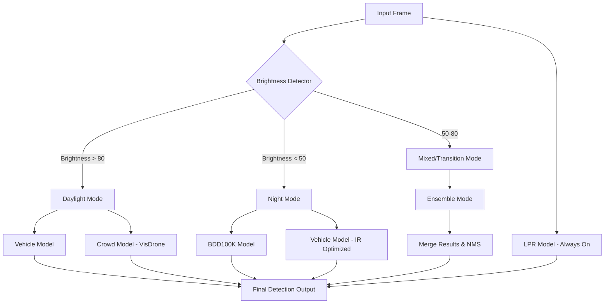

# AI Planning: Multi-Model Ensemble & Backup Pipeline
**Status:** Planning Phase (Review Required)
**Versi:** 1.0

---

## 1. Pendahuluan
Dokumen ini merinci strategi implementasi **Model Ensemble** pada Smart Parking AI Service. Tujuannya adalah memastikan sistem tetap akurat dalam berbagai kondisi pencahayaan (Siang, Malam, Remang) dan skenario (Jalan Raya, Parkiran, Drone View) dengan cara menggabungkan hasil dari beberapa model YOLOv8.

---

## 2. Arsitektur Pipeline

### 2.1 Alur Kerja Utama

---

## 3. Strategi Kondisional & Backup

| Kondisi | Sumber Data | Model Utama | Model Backup | Global Action |
| :--- | :--- | :--- | :--- | :--- |
| **Siang Hari** | Outdoor / Street | `vehicle_model` | `bdd100k_model` | **LPR + Crowded + Violation** |
| **Malam Hari** | Street / Highway | `bdd100k_model` | `visdrone_v1` | **LPR + Night Vision Boost** |
| **Basement / Remang**| Parking Area | `parking_model` | `bdd100k_model` | **LPR + Slot Status + Vehicle Type** |
| **Crowded** | Top View | `visdrone_v1` | `vehicle_model` | **Small Object Counting** |

---

## 4. Teknis Implementasi (AI Service)

### 4.1 Brightness Analysis Module
Menggunakan OpenCV untuk menghitung rata-rata intensitas pixel (Luminance) sebelum frame masuk ke model utama.

### 4.2 Parallel Inference Engine
Untuk mengurangi latency, model akan dijalankan secara paralel menggunakan `concurrent.futures.ThreadPoolExecutor`.
*   **Target Latency**: < 150ms per frame (untuk 2 model simultan).

### 4.3 Merge Logic (Non-Maximum Suppression)
Hasil deteksi dari dua model yang tumpang tindih (overlapping) akan digabungkan menggunakan teknik **NMS (Non-Maximum Suppression)** dengan `IoU (Intersection over Union) threshold 0.5`. Jika dua model mendeteksi objek yang sama, ambil yang memiliki *confidence score* tertinggi.

---

## 5. Rencana Perubahan Kode

### 5.1 `ai-service/app/services/ensemble_engine.py` (New)
*   Class `EnsembleEngine` untuk mengelola workflow model utama dan backup.
*   Logika `get_brightness()` dan `merge_results()`.

### 5.2 `ai-service/app/routers/traffic.py` (Update)
*   Integrasi `EnsembleEngine` pada endpoint `/traffic/stream` dan `/traffic/upload`.

---

## 7. Context-Aware Intelligence & Summaries
Sistem tidak hanya mengirim koordinat kotak, tapi juga menghasilkan narasi untuk Admin di Dashboard:

### 7.1 Automated Insight Generation
AI akan membandingkan hasil deteksi lintas-model untuk membuat ringkasan:
*   **Format**: `[ID_KAMERA]: [STATUS_DENSITAS] ([KONDISI_CAHAYA]), [JUMLAH] Kendaraan (Validasi via Plat: [SKOR_LPR])`.
*   **Contoh**: *"CCTV-Simpang-Pos: Padat (Siang Hari), 24 Kendaraan terdeteksi (22 Plat terbaca valid)."*

### 7.2 Parking Optimization (Low Light)
Di area parkir yang remang:
*   **Model Night-Vision** (BDD100K) membantu mengekstraksi kontur kendaraan agar **Parking Model** bisa menentukan status `Occupied/Empty` dengan lebih akurat.
*   **LPR Enhancement**: Menggunakan filter *Contrast Adjustment* otomatis jika brightness < 40 sebelum dikirim ke `lpr_model`.

### 7.3 Violation & Type Detection
*   **Illegal Parking**: Jika `vehicle_model` mendeteksi kendaraan di area non-slot (koordinat diluar zona parkir) selama > 5 menit.
*   **Classification**: Mengkategorikan data ke dalam: Car, Bus, Truck, Motorbike, Van untuk laporan statistik Executive Summary.

---

## 8. Tahapan Pengembangan (Roadmap)
1.  **Phase 1**: Implementasi modul `BrightnessDetector` dan benchmarking latency.
2.  **Phase 2**: Pembuatan script `ensemble_engine.py` dengan dummy merge logic.
3.  **Phase 3**: Integrasi model `bdd100k` dan `visdrone` ke dalam pipeline.
4.  **Phase 4**: Implementasi **Summary Generator Logic** (Logika Narasi).
5.  **Phase 5**: Fine-tuning NMS threshold untuk menghindari deteksi ganda (ghost objects).

---
> [!IMPORTANT]
> Konsep ini akan membuat sistem sangat tangguh (robust), namun membutuhkan resource GPU/CPU yang lebih besar. Disarankan menggunakan model versi `n` (Nano) atau `s` (Small) untuk menjaga performa real-time.
